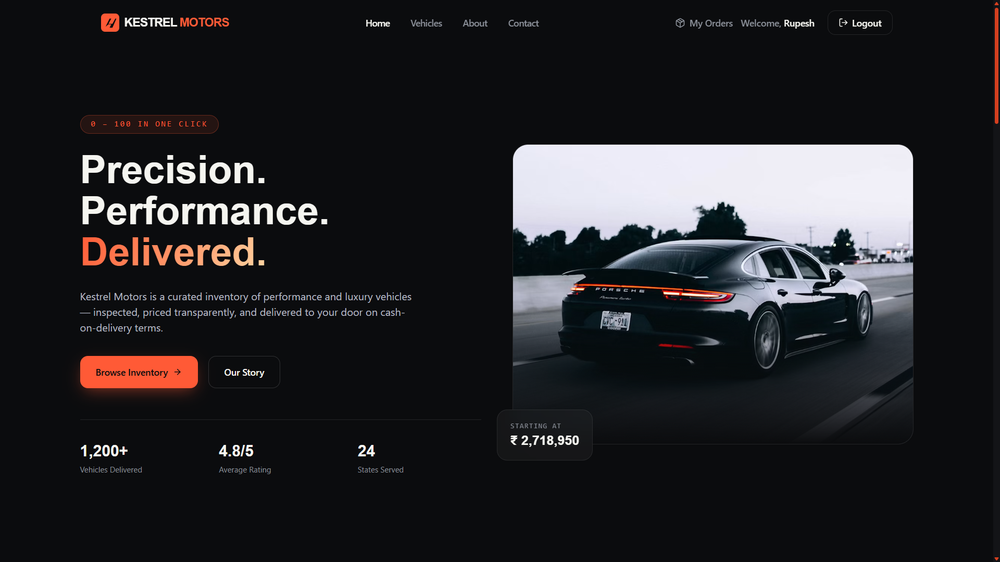
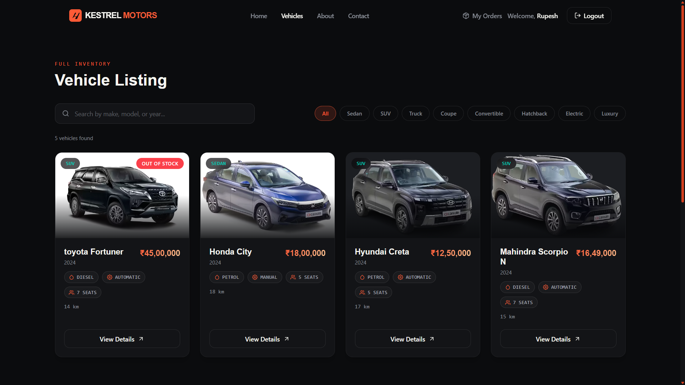
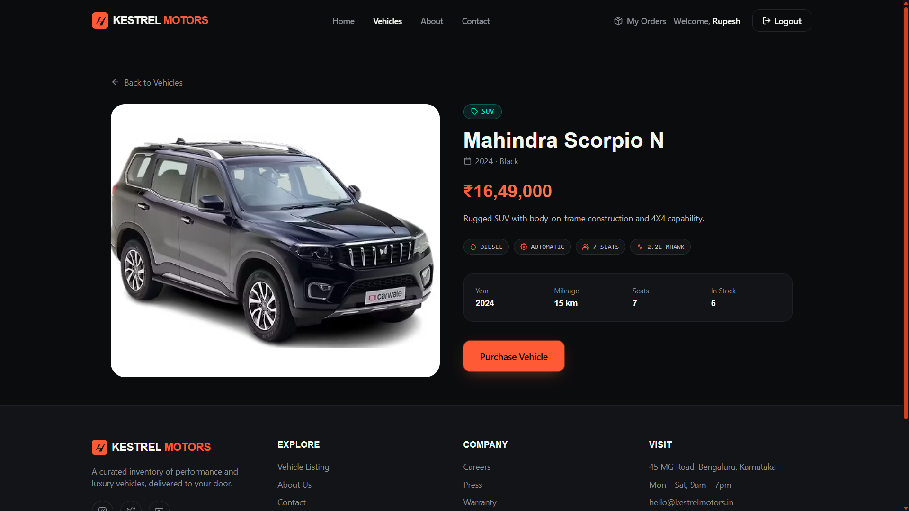
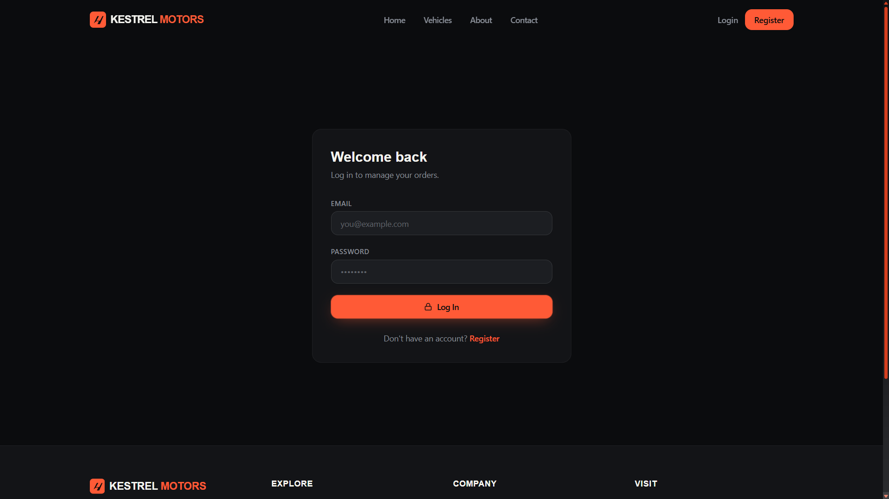
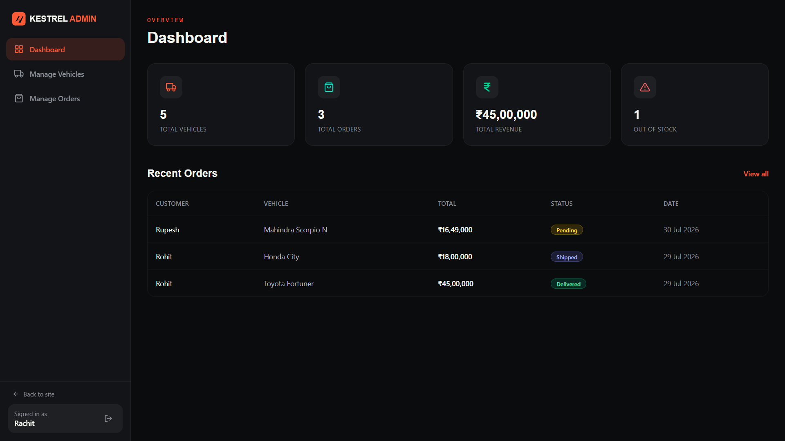
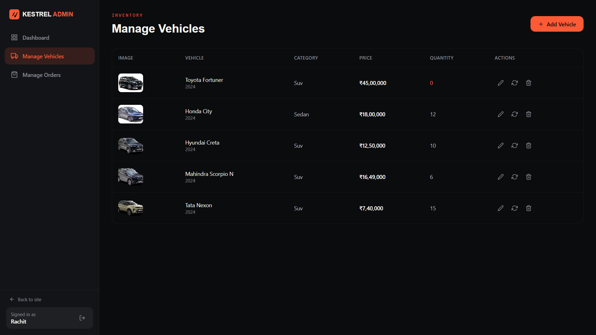
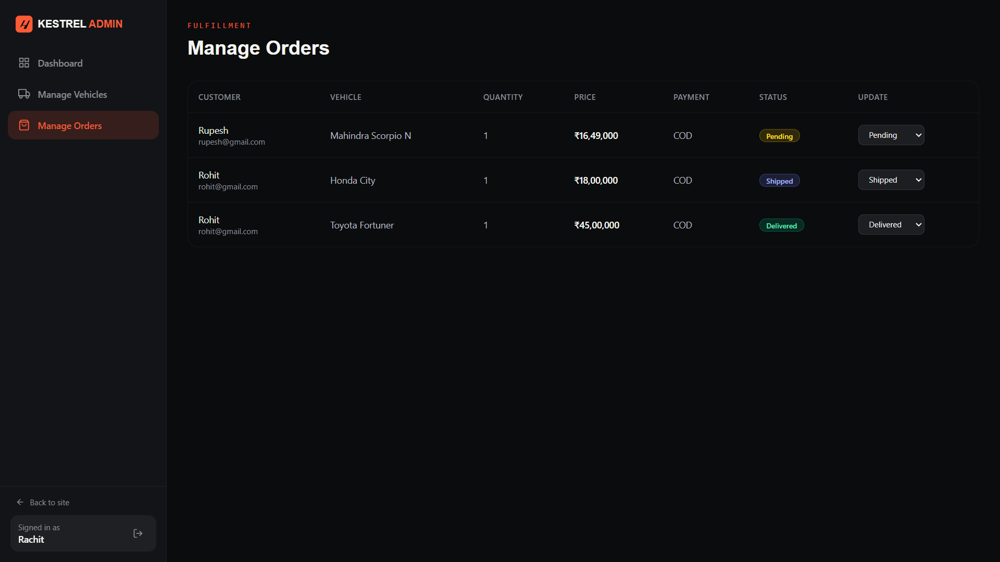
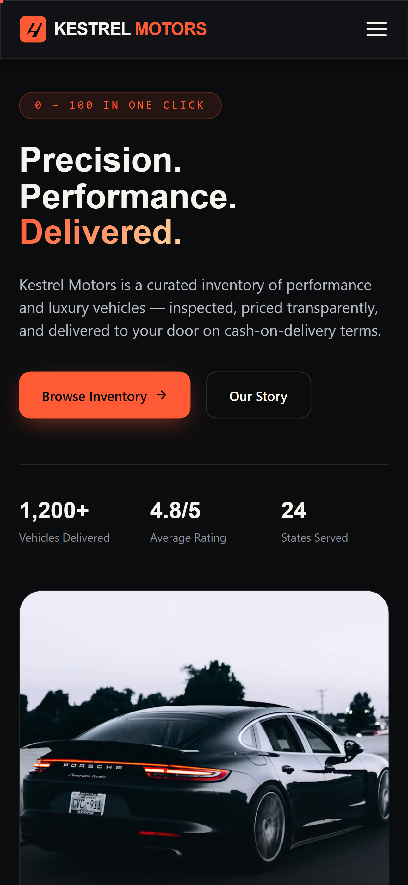
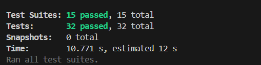

<p align="center">
  
</p>

<h1 align="center">KESTREL Motors</h1>

<p align="center">
  Premium Full-Stack Vehicle Marketplace built with the MERN Stack.
</p>

<p align="center">
  Browse premium vehicles, purchase cars online, and manage inventory through a modern admin dashboard.
</p>

---

## 📸 Project Preview

<p align="center">
  
</p>

---

## 🖼️ Screenshots

<p align="center">
  
  &nbsp;
  
</p>

<p align="center">
  
  &nbsp;
  
</p>

<p align="center">
  
  &nbsp;
  
</p>

<p align="center">
  
</p>

# ✨ Features

## Customer

- 🔐 JWT Authentication
- 👤 Register & Login
- 🚘 Browse Premium Vehicles
- 🔍 Search Vehicles
- 🏷 Filter by Category
- 📄 Detailed Vehicle Information
- 💳 Purchase Vehicles
- 📦 View Order History
- 📱 Fully Responsive Design

---

## Admin

- 📊 Dashboard Overview
- ➕ Add Vehicle
- ✏ Edit Vehicle
- ❌ Delete Vehicle
- 🔄 Restock Inventory
- 📋 Manage Orders
- 🔁 Update Order Status
- 📈 Revenue Statistics

---

# 🛠 Tech Stack

## Frontend

- React.js
- Vite
- Tailwind CSS
- React Router DOM
- Axios
- Framer Motion
- React Hot Toast
- React Icons

---

## Backend

- Node.js
- Express.js
- MongoDB
- Mongoose
- JWT
- bcrypt

---

# 📂 Project Structure

```text
car-dealership-inventory-system
│
├── frontend
│   ├── components
│   ├── pages
│   ├── layouts
│   ├── hooks
│   ├── services
│   ├── routes
│   ├── utils
│   └── assets
│
├── backend
│   ├── controllers
│   ├── middleware
│   ├── models
│   ├── routes
│   ├── utils
│   └── config
│
└── README.md
```

---

# 🚀 Installation

## Clone Repository

```bash
git clone https://github.com/nayan982/car-dealership-inventory-system.git
```

```
cd car-dealership-inventory-system
```

---

## Backend

```
cd backend
npm install
```

Create a `.env` file

```env
PORT=5000

MONGODB_URI=your_mongodb_connection

JWT_SECRET=your_secret

CLIENT_URL=http://localhost:5173
```

## Run Development Server

```bash
npm run dev
```

## Run Production Server

```bash
npm start
```

---

## Frontend

```
cd frontend
npm install
```

Create a `.env`

```env
VITE_API_URL=http://localhost:3000/api
```

Run

```bash
npm run dev
```

---

# 🔐 Authentication

- JWT Authentication
- Protected Routes
- Admin Routes
- Role-Based Access Control (RBAC)
- Secure Password Hashing (bcrypt)

---

# 📦 Main Modules

- Authentication
- Vehicle Inventory
- Vehicle Search
- Vehicle Details
- Purchase System
- Order Management
- Admin Dashboard

---

# 🎨 UI Highlights

- Premium Automobile Theme
- Dark Modern Interface
- Orange Accent Palette
- Fully Responsive Design
- Skeleton Loading
- Empty States
- Toast Notifications
- Smooth Page Transitions
- Framer Motion Animations

---

# 📱 Responsive

Optimized for

- 🖥 Desktop
- 💻 Laptop
- 📱 Tablet
- 📲 Mobile

---

# 🧪 Testing

The backend of KESTREL Motors includes automated API testing to verify core functionality and ensure application reliability.

## Testing Tools

- **Jest** – JavaScript testing framework
- **Supertest** – HTTP endpoint testing
- **MongoDB** – Test database for isolated execution

---

## Test Coverage

| Module | Test Cases |
|---------|------------|
| Authentication | Register, Login, Logout, Auth Middleware |
| Vehicle Management | Create, Update, Delete, Restock |
| Vehicle Features | Get Vehicles, Search Vehicles, Purchase Vehicle |
| Order Management | Get My Orders, Get All Orders, Update Order Status |
| Dashboard | Dashboard Statistics |

---

## Test Summary

```
Test Suites: 15 passed, 15 total
Tests:       32 passed, 32 total
Snapshots:   0 total
Status:      ✅ All tests passed
```

---

## Running Tests

Run all backend tests:

```bash
npm test
```

Run tests sequentially:

```bash
npm test -- --runInBand
```

---

## Test Report

<p align="center">
  
</p>

## 🤖 My AI Usage

During the development of this project, I used the following AI tools to assist my workflow:

### AI Tools Used
- ChatGPT
- Claude AI

### How I Used Them
- Brainstormed UI layouts and component structure for the frontend.
- Improved React component organization and code readability.
- Helped debug frontend and backend issues.
- Suggested better styling approaches using Tailwind CSS.
- Assisted in generating documentation, including this README.
- Provided explanations for concepts and implementation approaches when needed.

### Reflection

AI acted as a development assistant throughout the project by helping me explore ideas, debug issues, and improve code quality. I reviewed, modified, and integrated the suggestions into the project, which helped speed up development while ensuring I understood the implementation.

---

# 🔮 Future Improvements

- 💳 Online Payment Gateway
- ❤️ Wishlist
- ⚖️ Vehicle Comparison
- ⭐ Reviews & Ratings
- 📧 Email Notifications
- ☁️ Cloudinary Image Upload
- 📈 Analytics Dashboard

---